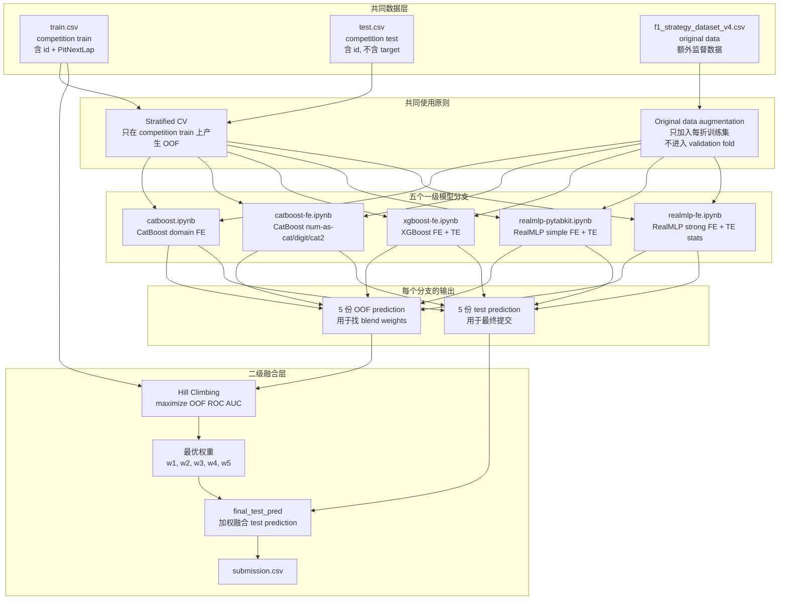
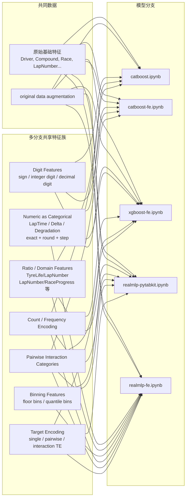

# Predicting F1 Pit Stops: 五模型 OOF Hill-Climbing Blend 框架

本项目用于预测 F1 比赛中某一位车手在当前圈之后的下一圈是否会进站。

- 任务类型：二分类
- 预测目标：`PitNextLap`
- 提交格式：`id`, `PitNextLap`
- 验证方式：每个一级模型生成 OOF prediction，再用 OOF ROC AUC 评估
- 最终方案：5 个 notebook 的 OOF/test prediction 通过 hill climbing 搜索权重后加权融合

## 1. 总体思路

核心流程是：

1. 五个 notebook 先分别训练一个一级模型分支。
2. 每个分支都输出一份 `OOF prediction` 和一份 `test prediction`。
3. Hill climbing 只使用 `OOF prediction + train label` 搜索最优 blend 权重。
4. 得到权重后，把同一组权重应用到五份 `test prediction` 上。
5. 生成最终 `submission.csv`。



## 2. 数据

三个数据文件是所有模型分支共同的基础。

| 数据 | 文件 | 行数 | 列数 | 用途 |
|---|---|---:|---:|---|
| Competition train | `train.csv` | 439,140 | 16 | 主训练数据，包含 `PitNextLap` |
| Competition test | `test.csv` | 188,165 | 15 | 最终提交需要预测的数据，不包含 target |
| Original F1 strategy data | `f1_strategy_dataset_v4.csv` | 101,371 | 16 | 额外监督数据，用于每折训练增强 |

Competition train/test 的基础特征是：

```text
Driver, Compound, Race, Year, PitStop, LapNumber, Stint, TyreLife,
Position, LapTime (s), LapTime_Delta, Cumulative_Degradation,
RaceProgress, Position_Change
```

`f1_strategy_dataset_v4.csv` 额外包含 `Normalized_TyreLife`。使用时需要注意：

- `realmlp-pytabkit.ipynb` 和 `realmlp-fe.ipynb` 会显式删除 `Normalized_TyreLife`。
- 其他分支会把 original data 对齐到 competition feature columns。
- original data 只作为训练增强，不参与 competition train 的 OOF validation。

## 3. 共同特征层

五个 notebook 不是完全独立乱做特征，而是有一些共同的特征族。下面按“共同程度”整理。



### 3.1 共同数据输入

所有分支都使用：

- competition `train.csv`
- competition `test.csv`
- external/original `f1_strategy_dataset_v4.csv`

共同原则是：

- OOF 只对应 competition train 的行。
- validation fold 不拼接 original data。
- original data 只拼进每折训练集，提高模型可学习的数据量。

### 3.2 `catboost-fe.ipynb` 和 `xgboost-fe.ipynb` 共享的 FE

这两个分支共享最明显，前半部分特征构造基本一致。

共同输入：

```text
BASE
+ NUM_as_CAT
+ DIGIT_FEATURES
```

`NUM_as_CAT` 来自三个连续变量：

- `LapTime (s)`
- `LapTime_Delta`
- `Cumulative_Degradation`

每个变量会生成：

- exact category
- round 到 1 位/0 位小数
- step-round category，例如 0.5、1、2、5、10、20 这类步长

`DIGIT_FEATURES` 来自：

- sign feature
- 整数位 digit
- 小数位 digit

覆盖的主要字段包括：

```text
Year, PitStop, LapNumber, Stint, TyreLife, Position,
LapTime (s), LapTime_Delta, Cumulative_Degradation,
RaceProgress, Position_Change
```

两者的区别是：

| 分支 | 在共享 FE 之后做什么 |
|---|---|
| `catboost-fe.ipynb` | 把 pairwise interaction 当作 CatBoost categorical feature，让 CatBoost 自己处理类别统计 |
| `xgboost-fe.ipynb` | 显式生成 frequency encoding 和 target encoding，再输入 XGBoost |

### 3.3 RealMLP 两个分支共享的 FE 思路

`realmlp-pytabkit.ipynb` 和 `realmlp-fe.ipynb` 都是 RealMLP 模型，特征思路也相近：

- ratio features
- numeric floor categories
- count encoding
- quantile binning
- interaction categories
- target encoding

区别是：

| 分支 | 特点 |
|---|---|
| `realmlp-pytabkit.ipynb` | 较简洁，只做少量 ratio、bin、interaction 和 TE |
| `realmlp-fe.ipynb` | 更强的 FE 版本，加入更多 num-as-cat、frequency encoding、pairwise TE 和 TE row statistics |

### 3.4 Target Encoding 的使用范围

显式 TE 主要出现在三个分支：

| 分支 | TE 类型 | 说明 |
|---|---|---|
| `xgboost-fe.ipynb` | cuML TargetEncoder | 对 `Driver`、`NUM_as_CAT`、pairwise combinations 做 fold-wise TE |
| `realmlp-pytabkit.ipynb` | sklearn TargetEncoder | 对 `Race_Compound`、`Race_Year` 等 selected interactions 做 TE |
| `realmlp-fe.ipynb` | cuML TE 或 manual fallback | 对 selected single columns 和 selected pairs 做 TE，并生成 TE row statistics |

`catboost.ipynb` 和 `catboost-fe.ipynb` 没有显式写出 sklearn/cuML TE，但 CatBoost 会通过自身的 categorical/CTR 机制学习类别统计信息。

## 4. 五个一级模型分支

| 分支 | Notebook | 模型 | CV / ensemble | 主要输入 |
|---|---|---|---|---|
| 1 | `catboost.ipynb` | CatBoost | 10-fold CV | 原始特征 + domain FE + digit/sign FE + frequency/count FE + group stats |
| 2 | `catboost-fe.ipynb` | CatBoost | 5 folds x 2 seeds | 原始特征 + `NUM_as_CAT` + `DIGIT_FEATURES` + pairwise categorical interactions |
| 3 | `xgboost-fe.ipynb` | XGBoost | 5 folds x 5 seeds | 原始特征 + `NUM_as_CAT` + `DIGIT_FEATURES` + frequency encoding + target encoding |
| 4 | `realmlp-pytabkit.ipynb` | RealMLP-TD | 5-fold CV | 原始特征 + ratio + count + quantile bins + selected interaction TE |
| 5 | `realmlp-fe.ipynb` | RealMLP-TD | 5-fold CV, 2 configs | strong RealMLP FE + frequency encoding + target encoding + TE statistics |

### 4.1 `catboost.ipynb`

这是一个 domain-feature-heavy 的 CatBoost 分支。

主要特征：

- estimated total laps
- laps remaining
- tyre age ratio
- degradation per tyre lap
- degradation per race lap
- lap time delta per tyre lap
- position pressure
- stint pressure
- pit-window pressure
- digit/sign features
- float/string precision features
- frequency/count features
- light group statistics

模型设置：

- `CatBoostClassifier`
- `n_splits = 10`
- `iterations = 11000`
- `learning_rate = 0.018`
- `depth = 8`
- GPU
- `eval_metric = "AUC"`
- early stopping: `500`

主要输出：

- `oof_predictions.csv`
- `submission.csv`
- `fold_metrics.csv`
- `cv_feature_importance.csv`
- ROC/PR/feature importance plots

### 4.2 `catboost-fe.ipynb`

这是一个偏 categorical interaction 的 CatBoost 分支。

输入结构：

```text
BASE
+ NUM_as_CAT
+ DIGIT_FEATURES
+ cat2 pairwise interaction features
```

pairwise interaction 来自以下字段的两两组合：

```text
Driver, Compound, Race, Year, PitStop, LapNumber, Stint,
TyreLife, Position, RaceProgress, Position_Change
```

模型设置：

- `CatBoostClassifier`
- 5 folds
- 每 fold 2 个 seed
- `iterations = 10000`
- `learning_rate = 0.03`
- `depth = 8`
- GPU
- early stopping: `200`

主要输出：

- `oof_cat_{cv_auc}.csv`
- `test_cat_{cv_auc}.csv`

### 4.3 `xgboost-fe.ipynb`

这是一个显式 FE + TE 的 XGBoost 分支。

输入结构：

```text
BASE
+ NUM_as_CAT
+ DIGIT_FEATURES
+ single-column frequency encoding
+ pairwise frequency encoding
+ single-column target encoding
+ pairwise target encoding
```

TE 设置：

- `cuML TargetEncoder`
- outer CV: 5 folds
- TE inner CV: 5 folds
- smoothing: `20`
- pairwise combinations 来自和 `catboost-fe.ipynb` 相同的 11 个基础字段

模型设置：

- `XGBClassifier`
- 5 folds
- 每 fold 5 个 seed
- `n_estimators = 10000`
- `learning_rate = 0.03`
- `grow_policy = "lossguide"`
- `max_leaves = 64`
- `tree_method = "hist"`
- `device = "cuda"`
- early stopping: `200`

主要输出：

- `oof_xgb_{cv_auc}.csv`
- `test_xgb_{cv_auc}.csv`

### 4.4 `realmlp-pytabkit.ipynb`

这是较简洁的 RealMLP 分支。

主要特征：

- `LapNumber / RaceProgress`
- `TyreLife / LapNumber`
- numerical floor categories
- count encoding
- quantile bins
  - `RaceProgress`: 200 bins
  - `LapTime (s)`: 7 bins
- interaction categories
  - `Race_Compound`
  - `Race_Year`
- sklearn `TargetEncoder`

模型设置：

- `RealMLP_TD_Classifier`
- 5-fold StratifiedKFold
- `n_ens = 24`
- `n_epochs = 6`
- hidden sizes: `[512, 256, 128]`
- activation: `silu`

主要输出：

- `oof_preds.csv`
- `submission.csv`

### 4.5 `realmlp-fe.ipynb`

这是更强的 RealMLP FE 分支。

全局 FE：

- basic ratio/arithmetic features
  - `_LapNumber_div_RaceProgress`
  - `_TyreLife_div_LapNumber`
  - `_TyreLife_minus_LapNumber`
  - `_LapNumber_x_RaceProgress`
- numeric-as-categorical features
  - exact category
  - rounded category
  - step-rounded category
  - floor category
- quantile bins
  - `RaceProgress`: 50, 100, 200 bins
  - `LapTime (s)`: 7, 15, 30 bins
  - `TyreLife`: 20, 50 bins
  - `LapNumber`: 20, 50 bins
- interaction categories
  - `Race x Compound`
  - `Race x Year`
  - `Driver x Compound`
  - `Driver x Race`
  - `Compound x LapNumber`
  - `Race x LapNumber`
  - `LapNumber x TyreLife`
  - `Position x RaceProgress`
- global count features

Fold-wise FE：

- frequency encoding
- target encoding
- pairwise TE
- TE row statistics
  - mean
  - std
  - min
  - max
  - range

模型配置：

| Config | Hidden sizes | Ensemble size | Epochs |
|---|---:|---:|---:|
| `silu_plr_512x256x128_ens12` | `[512, 256, 128]` | 12 | 8 |
| `silu_plr_768x384x192_ens8` | `[768, 384, 192]` | 8 | 8 |

主要输出：

- `oof_strong_realmlp_goodparts_*.csv`
- `test_strong_realmlp_goodparts_*.csv`
- `submission_strong_realmlp_goodparts_*.csv`
- `strong_realmlp_goodparts_summary.csv`
- `strong_realmlp_goodparts_fold_scores.csv`

## 5. 最终 Hill-Climbing Blend

五个一级模型分别得到：

```text
OOF predictions:
p1_oof, p2_oof, p3_oof, p4_oof, p5_oof

Test predictions:
p1_test, p2_test, p3_test, p4_test, p5_test
```

Hill climbing 的优化目标是：

```text
maximize ROC_AUC(y_train, w1*p1_oof + w2*p2_oof + ... + w5*p5_oof)
```

通常约束为：

```text
w_i >= 0
sum(w_i) = 1
```

找到最优权重后，最终 test prediction 为：

```text
final_test_pred = w1*p1_test + w2*p2_test + w3*p3_test + w4*p4_test + w5*p5_test
```

最后生成：

```text
submission.csv = id + final_test_pred
```

## 6. Blend 输入表

当前仓库里有 5 个 notebook，但没有保存最终 hill-climbing 脚本、最终权重、以及生成后的 OOF/test prediction CSV。因此下面的权重需要根据你的 hill-climbing 运行结果补上。

| 分支 | OOF file | Test prediction file | 最终权重 |
|---|---|---|---:|
| `catboost.ipynb` | `oof_predictions.csv` | `submission.csv` 或该分支 test pred 文件 | TBD |
| `catboost-fe.ipynb` | `oof_cat_{cv_auc}.csv` | `test_cat_{cv_auc}.csv` | TBD |
| `xgboost-fe.ipynb` | `oof_xgb_{cv_auc}.csv` | `test_xgb_{cv_auc}.csv` | TBD |
| `realmlp-pytabkit.ipynb` | `oof_preds.csv` | `submission.csv` | TBD |
| `realmlp-fe.ipynb` | selected `oof_strong_realmlp_goodparts_*.csv` | selected `test_strong_realmlp_goodparts_*.csv` | TBD |

## 7. 防止 leakage 的规则

需要保持以下规则：

- OOF validation 只评估 competition train 的 validation fold。
- original data 只能拼入每折训练集，不能拼入 validation fold。
- target encoding 必须在 fold 内完成，validation/test 只能 transform，不能参与 target mean 的拟合。
- hill climbing 只能用 OOF prediction 和 train label 搜索权重。
- test prediction 只能在权重确定后用于最终加权。
- Public/private leaderboard 不应该作为 hill climbing 的直接优化目标。

## 8. 复现实验注意事项

- `xgboost-fe.ipynb` 和两个 CatBoost 分支使用 GPU 设置。
- RealMLP 分支依赖 `pytabkit`。
- `xgboost-fe.ipynb` 和 `realmlp-fe.ipynb` 优先使用 cuML target encoder。
- 本 README 是根据当前 5 个 notebook 源码和本地 CSV header/shape 整理的。
- 当前本地 Python 环境缺少 `pandas`，所以没有在本地重新执行 notebook。
